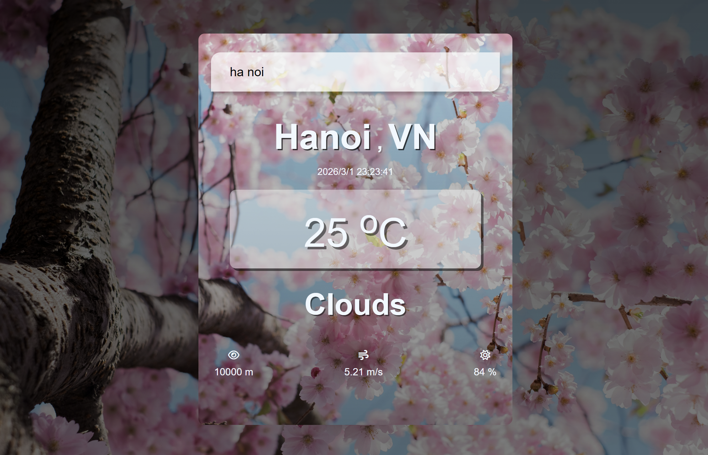

# Weather-app-use-api
1. Overview / 概要
This project is a simple web-based Weather Application that allows users to search for real-time weather information by city name. It uses the OpenWeatherMap API to display temperature, humidity, wind speed, visibility, and weather conditions. The project demonstrates front-end development skills, API integration, UI design, and documentation ability.
本プロジェクトは、ユーザーが都市名を入力することでリアルタイムの天気情報を取得・表示する Web アプリケーションです。OpenWeatherMap API を利用し、気温、湿度、風速、視程、天気概要などを表示します。フロントエンド開発、API 連携、UI 設計、ドキュメント作成能力を示すことを目的としています。

2. Features / 主な機能
 -  Search weather by city name                                       都市名による天気検索
 -  Display temperature (°C), humidity, wind speed, visibility        気温（℃）、湿度、風速、視程の表示
 -  Show weather description (Clouds, Clear, Rain, etc.)              天気概要（Clouds、Clear、Rain など）の表示
 -  Auto-update local time                                            データ取得時にローカル時間を自動更新
 -  Error handling for invalid city names                             存在しない都市名の場合のエラー処理

3. Tech Stack / 使用技術
 - HTML
 - CSS
 - JavaScript 
 - OpenWeatherMap API

4. System Flow / システムフロー
 - User enters a city name-                          ユーザーが都市名を入力
 - App sends request to OpenWeatherMap API           アプリが OpenWeatherMap API にリクエスト送信
 - API returns JSON data                             API が JSON データを返却
 - App extracts necessary fields                     必要なデータを抽出
 - UI updates dynamically                            UI に反映
 - If city not found → hide UI + show error          都市が見つからない場合 → UI 非表示 + エラー表示

5. API Specification / API 仕様
Endpoint / エンドポイント
https://api.openweathermap.org/data/2.5/weather
Parameters / パラメータ
- q — City name / 都市名
- appid — API key / API キー
Example Request / リクエスト例
https://api.openweathermap.org/data/2.5/weather?q=Tokyo&appid=YOUR_API_KEY

6. How to Run / 実行方法
 - Download the project folder                 プロジェクトフォルダをダウンロード
 - Open index.html in a browser                index.html をブラウザで開く

7. Project Structure / プロジェクト構成
/project-folder
│── index.html
│── style.css
│── js/
│     └── app.js
└── img/
      ├── spring.jpg
      └── screenshot.png

8. Screenshots / スクリーンショット

9. Purpose of the Project / プロジェクトの目的
This project was created to practice API integration and improve my documentation and system‑flow understanding as part of my BrSE learning path.
本プロジェクトは、API 連携・ドキュメント作成・システム理解の習得を目的として作成しました。